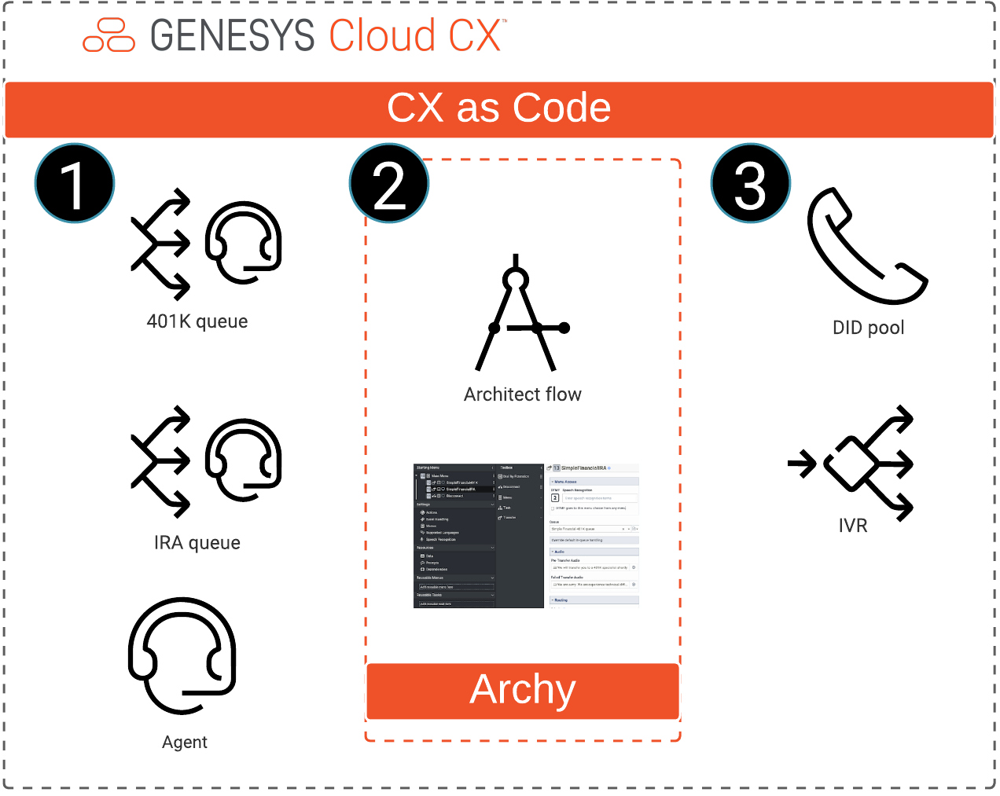

This Genesys Cloud Developer Blueprint provides a basic example of how to deploy a touch-tone based IVR using Terraform, CX as Code, and Archy.

This blueprint demonstrates how to:

* Create users using CX as Code
* Create queues using CX as Code
* Deploy a simple IVR flow using Archy from within a CX as Code flow
* Attach a DID phone number to the deployed IVR flow

## Scenario

An organization is interested in deploying a Genesys Cloud Architect flow and its dependent objects (queues, data actions, and so on) immutably across all of their Genesys Cloud organizations without the need for a Genesys Cloud administrator to manually set up and configure these objects in each of their Genesys Cloud environments. The Genesys Cloud administrator wants to understand how to do this using CX as Code with a very simple example.

## Solution

Developers use Archy and CX as Code to manage their Architect flow and dependent objects as plain text files. After these objects are defined they can be deployed to Genesys Cloud using Terraform.



The following are the deployment phases of Genesys Cloud objects within this flow:

1. **Pre-Archy invocation**. Queues and users need to be created before the IVR Architect flow is deployed so that it deploys successfully.  
2. **Archy flow deployment**. The Architect flow is deployed from within CX as Code using the Archy CLI.
3. **Post-Archy invocation**. CX as Code creates the DID pool that contains the phone number for the IVR. Then CX as Code creates the IVR configuration.

:::primary
**Note: After the Archy flow creates the IVR, there is still a post-configuration step to make it available for use.**
:::

## Contents

* [Solution components](#solution-components "Goes to the Solution components section")
* [Prerequisites](#prerequisites "Goes to the Prerequisites section")
* [Implementation steps](#implementation-steps "Goes to the Implementation steps section")
* [Additional resources](#additional-resources "Goes to the Additional resources section")

## Solution components

* **Genesys Cloud** - A suite of Genesys Cloud services for enterprise-grade communications, collaboration, and contact center management. In this solution, you use an Architect inbound email flow, along with a Genesys Cloud integration, data action, queues, and email configuration.
* **Archy** - A Genesys Cloud command-line tool for building and managing Architect flows.
* **CX as Code** - A Genesys Cloud Terraform provider that provides a command line interface for declaring core Genesys Cloud objects.

## Prerequisites

### Specialized knowledge

* Administrator-level knowledge of Genesys Cloud
* Experience using Terraform
* Experience using Archy

### Genesys Cloud account

* A Genesys Cloud license. For more information, see [Genesys Cloud Pricing](https://www.genesys.com/pricing "Opens the Genesys Cloud pricing page") in the Genesys website.
* Master Admin role. For more information, see [Roles and permissions overview](https://help.mypurecloud.com/?p=24360 "Opens the Roles and permissions overview article") in the Genesys Cloud Resource Center.
* Archy. For more information, see [Welcome to Archy](/devapps/archy/ "Goes to the Welcome to Archy page").
* CX as Code. For more information, see [CX as Code](https://developer.genesys.cloud/api/rest/CX-as-Code/ "Opens the CX as Code page").

### Development tools running in your local environment
* Terraform (the latest binary). For more information, see [Download Terraform](https://www.terraform.io/downloads.html "Opens the Download Terraform page") in the Terraform website.

## Implementation steps

### Define the environment variables

First define the environment variables that hold the OAuth credential grant that is used by CX as Code to provision the Genesys Cloud objects.

  * `GENESYSCLOUD_OAUTHCLIENT_ID` - This is the Genesys Cloud client credential grant Id that CX as Code executes against.
  * `GENESYSCLOUD_OAUTHCLIENT_SECRET` - This is the Genesys Cloud client credential secret that CX as Code executes against.
  * `GENESYSCLOUD_REGION` - This is the Genesys Cloud region in which your organization is located.

Next, replace the phone numbers in the `genesyscloud_telephony_providers_edges_did_pool` and `genesyscloud_architect_ivr`
Terraform resources, which are located in the blueprint/main.tf file. This phone number should be a phone number you (or your organization) own and you want to associate with the IVR.

```hcl
resource "genesyscloud_telephony_providers_edges_did_pool" "mygcv_number" {
  start_phone_number = "+19205422729"              # This needs to be changed
  end_phone_number   = "+19205422729"              # This needs to be changed
  description        = "GCV Number for inbound calls"
  comments           = "Additional comments"
  depends_on = [
    null_resource.deploy_archy_flow
  ]
}

resource "genesyscloud_architect_ivr" "mysimple_ivr" {
  name               = "A simple IVR"
  description        = "A sample IVR configuration"
  dnis               = ["+19205422729", "+19205422729"]  # This needs to be changed
  open_hours_flow_id = data.genesyscloud_flow.mysimpleflow.id
  depends_on         = [genesyscloud_telephony_providers_edges_did_pool.mygcv_number]
}
```

### Deploy the Genesys Cloud objects

Deploy the Architect flow and Genesys Cloud objects:

`terraform apply --auto-approve`

## Test your flow

Dial the phone number you entered in the blueprint/main.tf file. If everything deployed correctly, you should hear the IVR pick up and answer with
"Hi welcome to SimpleFinancial.  Please listen to our menu carefully."

## Additional resources

* [Terraform](https://terraform.io "Opens the Terraform Cloud sign page") in the Terraform website
* [CX as Code](https://developer.genesys.cloud/api/rest/CX-as-Code/ "Opens the CX as Code page") in the Genesys Cloud Developer Center
* [Terraform Registry Documentation](https://registry.terraform.io/providers/MyPureCloud/genesyscloud/latest/docs "Opens the Genesys Cloud provider page") in the Terraform documentation
* [Genesys Cloud Archy](https://developer.genesys.cloud/devapps/archy/ "Opens the Genesys Cloud Archy documentation") in Genesys Cloud Developer Center
* [simple-ivr-deploy-with-cx-as-code-blueprint repository](https://github.com/GenesysCloudBlueprints/simple-ivr-deploy-with-cx-as-code-blueprint "Goes to the simple-ivr-deploy-with-cx-as-code-blueprint repository") in Github
